## Sonic Rider- Taxi booking App UI for visually impaired!

Hi! This is the clone to the App based Taxi booking Services like Uber using Flutter for blind people. This app is a game-changer for blind passengers using taxis or ride-sharing services. Designed with accessibility and independence in mind, it provides a seamless experience through audio-based features. With a user-friendly interface, the app allows blind individuals to book rides, manage trip details, and communicate with drivers effortlessly using voice commands. Real-time trip updates keep them informed throughout the journey, addressing the lack of visual cues. The app's innovative approach empowers blind passengers to navigate the world of transportation with confidence, ensuring inclusivity and enhancing their overall mobility experience.

## ScreenShots

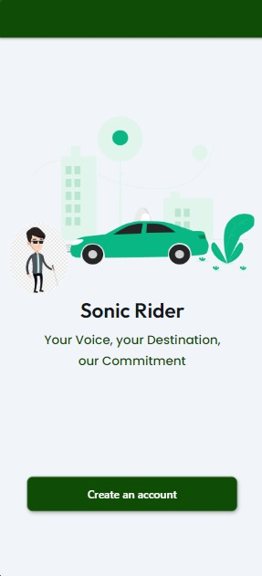  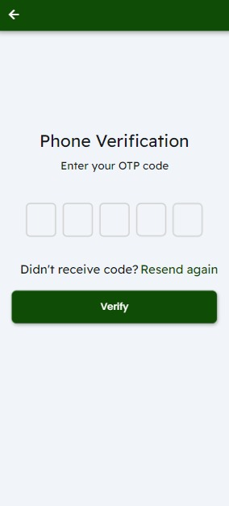 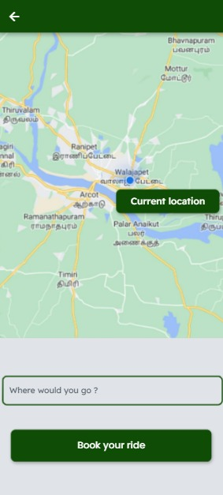 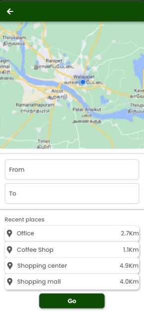 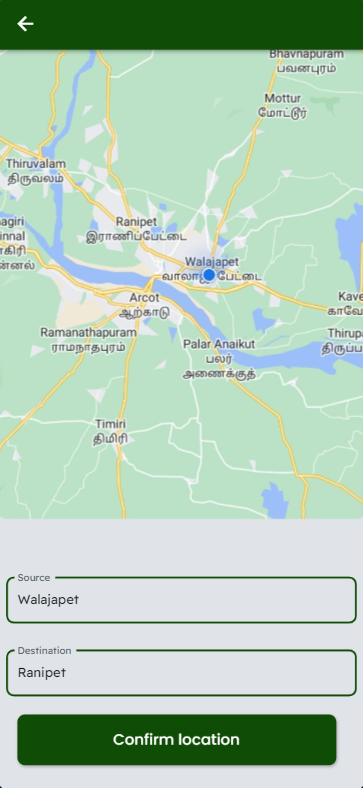 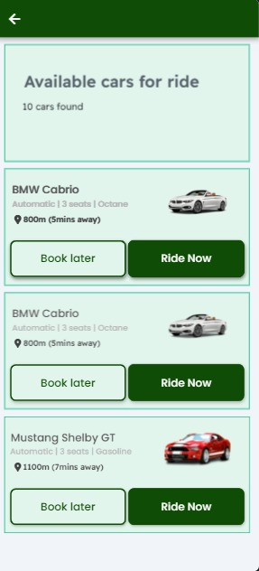 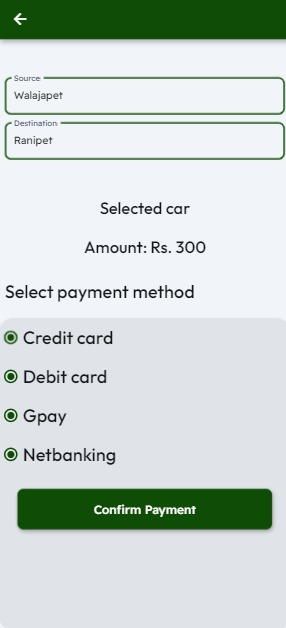  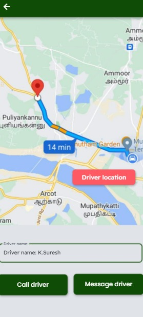  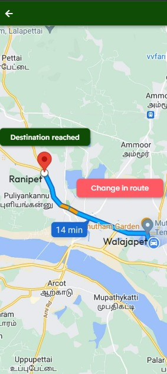 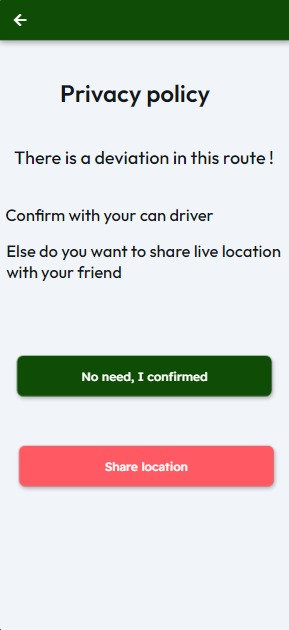 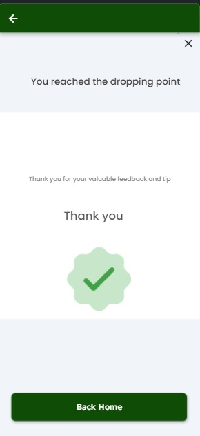

## Features

Some of the listed features implemented are :

<h2>Voice based ride booking</h2>
  Enable blind users to book a ride using voice commands. They can specify their current location, destination, and any accessibility preferences or special instructions.

<h2>Real time assistance</h2>
  The voice assistant can inform blind users about the estimated arrival time, vehicle details (e.g., license plate number, car model), and driver information (e.g., name, rating).

<h2>Voice navigation</h2>
  Incorporate voice-guided navigation that provides step-by-step instructions to help blind passengers locate pickup points, track the approaching vehicle, and navigate to their destination.

<h2>Location updates</h2>
  Provide periodic voice-based updates on the current location of the vehicle during the trip. Blind users can receive information about landmarks, intersections, or points of interest to help them understand their progress and maintain situational awareness.

<h2>Route deviations</h2>
  Alert blind passengers about any route deviations or detours that may occur during the trip. The voice notifications can provide explanations for the changes and estimated additional travel time, if applicable.

## To run the app

First clone this repository in your machine
To run the app, install all the dependencies in pubspec.yaml
Add your own firebase account 
